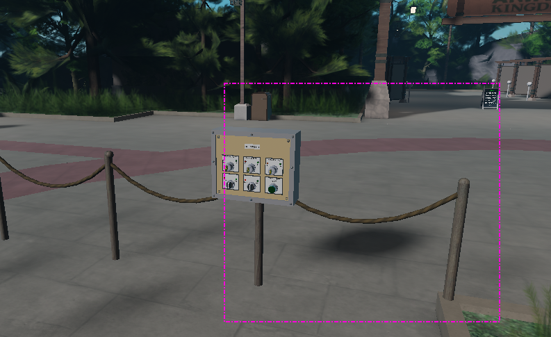
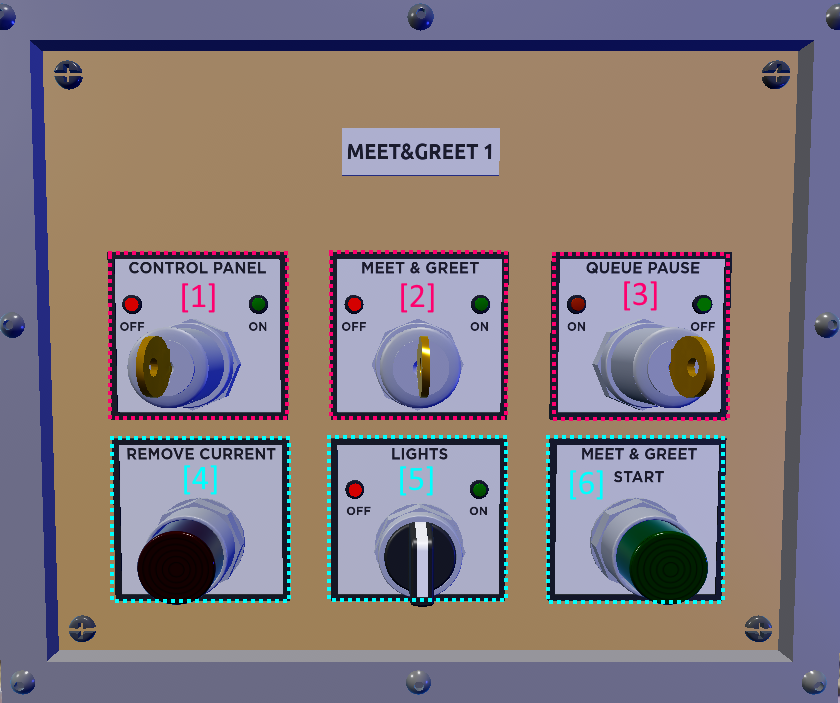
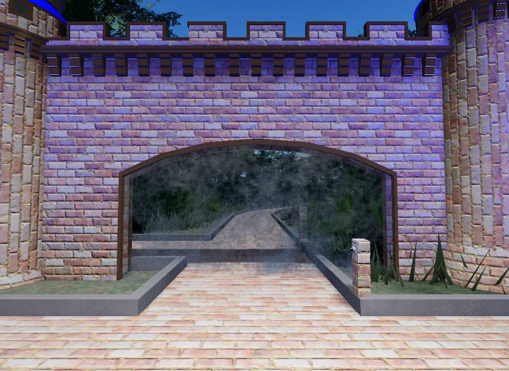

# Meet & Greet Panel

There is a pathyway that you should use to access the cast area. **(See below)**

<figure><figcaption>
Cast Entrance to Meet &#x26; Greet Area
</figcaption></figure>

The panel itself is very simple and requires no extra training. However, we ask you to read this document carefully.\
\
Below are the buttons and their purposes, along with extra information.

<figure><figcaption>
Meet &#x26; Greet Labelled Panel
</figcaption></figure>

\[1] - This is the power button, this is the first and last thing that you will click when operating. (PLEASE NOTE - TURNING THIS OFF KICKS EVERYONE OUT OF THE QUEUE)

\[2] - This opens and closes the queue. (PLEASE NOTE - TURNING THIS OFF KICKS EVERYONE OUT OF THE QUEUE)

\[3] This puts a temporary stop on any else joining the queue whilst allowing everyone already in the queue to remain there. This could be used during a character changeover, for example.

\[4] This button should be used when there is a guest that refuses to leave. Guests should be given a chance to leave before this is pressed.

\[5] This switch allows the area to be illuminated, this switch should be turned on whenever the queue is opened.

\[6] This button is used to admit the next person into the meet and greet area.

There is a waterfall feature, please ensure you turn the waterfall \*\***OFF\*\*** before walking through it. Please re-enable it when you pass through. **(See below)**&#x20;

<figure><figcaption>
Waterfall Feature Switch
</figcaption></figure>

 

<figure><figcaption>
Waterfall Referenced
</figcaption></figure>

### \*\*IMPORTANT NOTES\*\*

\-Please ensure that you DO NOT power off the panel if there are still people in the queue. (Unless you want to kick all of them out)

\-Only turn the panel on and enable when you are ready to begin.

\-Please report any bugs to tamtom\_gamingyt#0612

If you have any questions please leave a message in cast chat etc. Thank you for taking the time to read through this guide.
