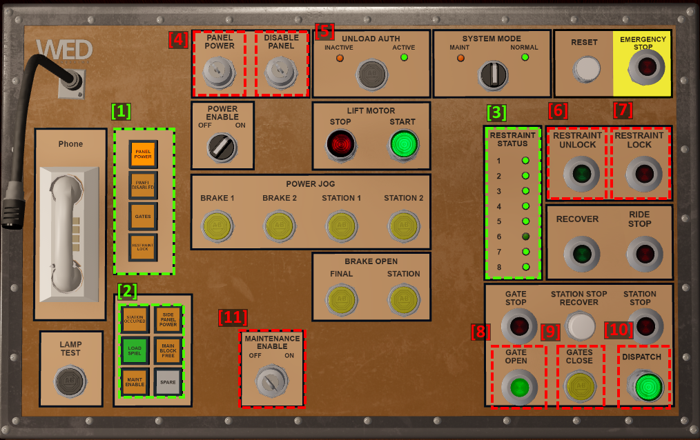
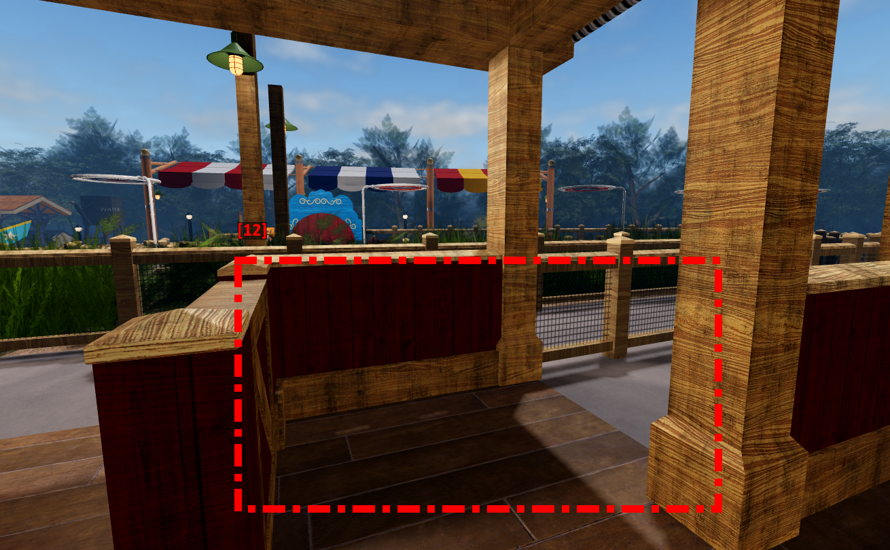
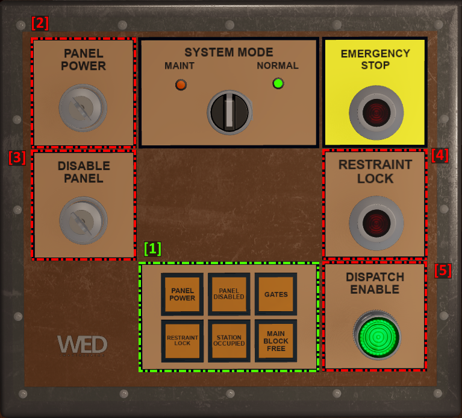

# 📕 Panel Information

## Main Panel

<figure><figcaption>
Barnstormer Main Panel
</figcaption></figure>

<figure><figcaption>
Crowd control section (will only work when main panel is on)
</figcaption></figure>

1. **Station Indicators (A):** _(Ordered from top to bottom)_
   * Panel Power - Indicates if the panel is powered on or off.
   * Panel Disabled - Indicates if panel is disabled.
   * Gates - Indicates if gates are opened or not. If they are open and not moving, then it will be on. If the gates are moving, it will be blinking, otherwise; it'll be off.
   * Restraint Lock - Indicates if the restraints are locked or not. If the restraints are locked, it'll be on; if they are available to lock, it will blink and it'll be off otherwise.
2. **Station Indicators/Buttons (B):**
   * Station Occupied _(Top Left)_ - Indicates if the station is occupied.
   * Side Panel Power _(Top Right)_ - Indicates if the side panel is turned on.
   * Load Spiel _(Middle Left)_ - Click to play the load spiel. Will illuminate whilst playing.
   * Main Block Free _(Middle Right)_ - Indicates if the main block section is free.
   * Maint Enable _(Bottom Left)_ - Indicates if maintenance enable mode is on.
   * ~~Spare _(Bottom Right)_ - Non-Functional.~~&#x20;
3. **Restraint Indicators:** Indicate if the restraint is lowered. If the indicator is off, then it is not lowered; if its on, then it is.
4. **Power Key:** This key is used to power on or off the panel. Click it to change its state from on to off or from off to on.&#x20;
5. **Disable Panel Key:** <mark style="color:blue;">(</mark><mark style="color:blue;">**Manager**</mark><mark style="color:blue;">+)</mark> This key is used to toggle disabling the panel.
6. **Restraint Unlock:** Unlocks the restraints of the train in the station. Will flash when available.
7. **Restraint Lock:** Locks the restraints of the train in the station. Will flash when available.
8. **Gates Open:** Opens the station gates. Will flash when available and will be on when gates are open.
9. **Gates Close:** Closes the station gates.
10. **Dispatch:** Dispatches the train in the station. Will flash when available.
11. **Maintenance Enable Key:** <mark style="color:red;">**(Lead Imagineer+)**</mark> This key is used to turn the maintenance enable mode on/off .
12. **Crowd Control Rope:** Click to open/close crowd control rope. Will display a rope when closed.

## Side Panel

<figure><figcaption>
Side Panel
</figcaption></figure>

1. **Station Indicators/Buttons (B):**
   * Panel Power _(Top Left)_ - Indicates if the panel is powered on or off.
   * Panel Disabled _(Top Center)_ - Indicates if panel is disabled.
   * Gates _(Top Right)_ - Indicates if gates are opened or not. If they are open and not moving, then it will be on. If the gates are moving, it will be blinking, otherwise; it'll be off.
   * Restraint Lock _(Bottom Left)_ - Indicates if the restraints are locked or not. If the restraints are locked, it'll be on; if they are available to lock, it will blink and it'll be off otherwise.
   * Station Occupied _(Bottom Center)_ - Indicates if the station is occupied.
   * Main Block Free _(Bottom Right)_ - Indicates if the main block section is free.
2. **Power Key:** This key is used to power on or off the panel. Click it to change its state from on to off or from off to on.&#x20;
3. **Disable Panel Key:** <mark style="color:blue;">(</mark><mark style="color:blue;">**Manager**</mark><mark style="color:blue;">+)</mark> This key is used to toggle disabling the panel.
4. **Restraint Lock:** Locks the restraints of the train in the station. Will flash when available.
5. **Dispatch Enable:** Dispatch enables the train in the station. Will flash when available.
