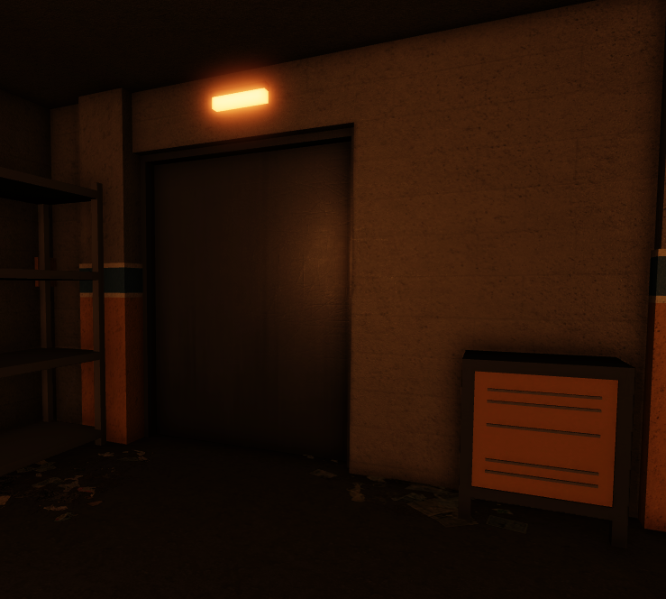

# 🎢 Rock 'n' Roller Coaster




[operating-procedures.md](operating-procedures.md)



[scripts.md](scripts.md)


### Staff Commands

You can use the following commands to teleport you around the game:

* **/stp a**: Teleports you to the greeter panel, specifically outside of the preshow room.
* **/stp p**: Teleports you outside of the pre-show, specifically in the clock room.
* **/stp l**: Teleports you to the load platform, specifically outside of the main panel.&#x20;
* **/stp u**: Teleports you to the unload platform, specifically aside from the panel.&#x20;
* **/stp e**: Teleports you to the exit.

### Staff Paths

To walk between the load/unload stations, you can use a corridor that communicates both stations.

<table data-view="cards"><thead><tr><th></th><th></th><th></th></tr></thead><tbody><tr><td>Load Station Corridor Entrance</td><td></td><td></td></tr><tr><td></td><td></td><td>/</td></tr><tr><td></td><td></td><td></td></tr></tbody></table>

Incident Management

#### Guest refusing to take a seat

If this should happen, and you've repeatedly asked the guest to take a seat and they refuse, then you should try contacting a manager+ (if they're online), and let them know about the issue (it's also important to let them know the user's name). However, since we want to give the rest of the guests the best experience possible, you should not wait until the incident is solved to continue the normal operations and just continue and let the manager+ deal with it.

#### Guest refusing to leave room

If this should happen, and you've repeatedly asked the guest to exit and they refuse, then you should try contacting a manager+ (if they're online), and let them know about the issue (it's also important to let them know the user's name). However, since we want to give the rest of the guests the best experience possible, you should not wait until the incident is solved to continue the normal operations and just continue and let the manager+ deal with it
