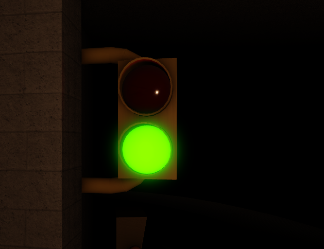

# Operating Procedures

* [Load station](operating-procedures.md#load-station)
  * [Main panel-only operations](operating-procedures.md#main-panel-only-operations)
  * [Multiple panel operations](operating-procedures.md#multiple-panel-operations)
* [Unload station](operating-procedures.md#unload-station)
* [Preshow](operating-procedures.md#preshow)
* [Queue](operating-procedures.md#queue)
  * [Greeter station](operating-procedures.md#greeter-station-1)

## Load station

#### Main panel-only operations

When there's only 1 active cast member, meaning there is only 1 panel on, you must use the main panel. If you were previously operating with 2 panels and one of the cast members has to leave, please turn off the side panel and go to the main panel to continue operating from there _(you won't be able to dispatch by only using the side panel)_.

When the train reaches the station play the load spiel, then open the gates. Then wait until the spiel has finished playing (this includes the Spanish part of the spiel) and for the launch block zone to be free.

<figure><figcaption>
Located above the loading platform, light will flash green when the launch block is free.
</figcaption></figure>

Then, if no one is boarding the train, close the gates. After closing the gates, wait a couple of seconds and once everyone is sitting in their seats, lock the restraints. After locking the restraints, enable the dispatch and dispatch the train _(after you press the enable dispatch, you'll have 5 seconds to press dispatch before you need to enable it again)_.

If a person refuses to sit for a reasonable amount of time and/or is delaying the operations, you can lock the restraints/close the gates and dispatch the train without them. Please contact a supervisor if the situation escalates.

#### Multiple panel operations


Side panels should only be operated if the main panel is being operated.


When there are 2 active panels the main panel loses some functions. It wont be able to operate the gates nor will be able to release the restraints.

When the train reaches the station, the main panel operator will play the safety spiel and then the side panel operator will open the gates. Then wait until the spiel has finished playing (this includes the Spanish part of the spiel) and for the launch block zone to be free.

Once both conditions are true, if no one is boarding the train, the side panel operator will close the gates. After closing the gates, wait a couple of seconds and once everyone is sitting in their seats, the side panel operator will lock the restrains. After this the lock restraint button on the main panel will start flashing and the main panel operator will press it to lock the restrains. Only after both panels have locked the restraints will the restraints fully lock. Once the restraints are locked, we are able to dispatch the train. To do this we need to follow a specific order of operations. First, the side panel operator will enable the dispatch. This will give the main panel operator 15 seconds to enable and dispatch the train.

## Unload station

When the train reaches the unload station, you will first release the restraints. Then you will wait until the load station is free.

<figure><figcaption>
Located on the left wall at the end of the unload station. The traffic light will turn green when the load station is free.
</figcaption></figure>

Once the load station is free, you'll dispatch the train.

## Preshow

You will start the cycle by clicking start pre-preshow, this will start the animation loop of the characters that will play whilst guests are entering the preshow. When you click the button, if manual doors is turned off, the exit doors will close and the entrance ones will open. Here you must ask people to enter the room and make space for everyone. Then, once everyone has entered the room, you can press the start preshow button, which will start the main preshow. When the exit doors open, instruct everyone to exit through the exit doors. Please wait until everyone has left to start the pre-preshow again _(which will close the exit doors)_. **Please also wait until the door in the preshow window has closed **_**(or the animation has stopped)**_** to start the pre-preshow.**

If you're a <mark style="color:yellow;">Senior CM+</mark> , then you can enable manual doors if you wish to control the entrance and exit doors manually. When everyone has exited the room, before pressing the start pre-preshow button you need to make sure the exit doors are closed. Then, once the pre-preshow is running, you can open the entrance doors. Once everyone is in you can close the entrance doors and start the preshow. We recommend you then open the exit doors once the room lights return to normal (since they fade during the preshow); which is around when the manager calls a taxi.

## Queue

#### Greeter station

When you're in the greeter station, you're in charge of letting people into the area before the preshow. First of all, set the standard queue switch to closed. Then, once someone comes, ask how many people form their party. Then, if you consider there's space in the preshow room or in the area before the preshow (where people would be waiting to enter the preshow), you let them in by opening the standard queue. Once they've passed you, you can close it back again.
