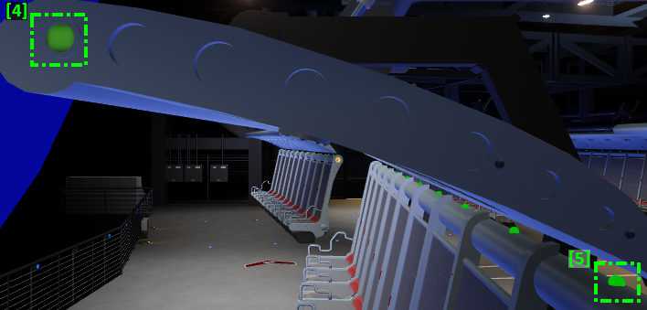
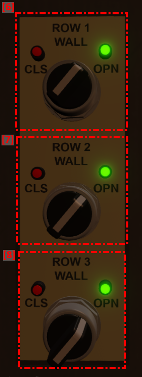
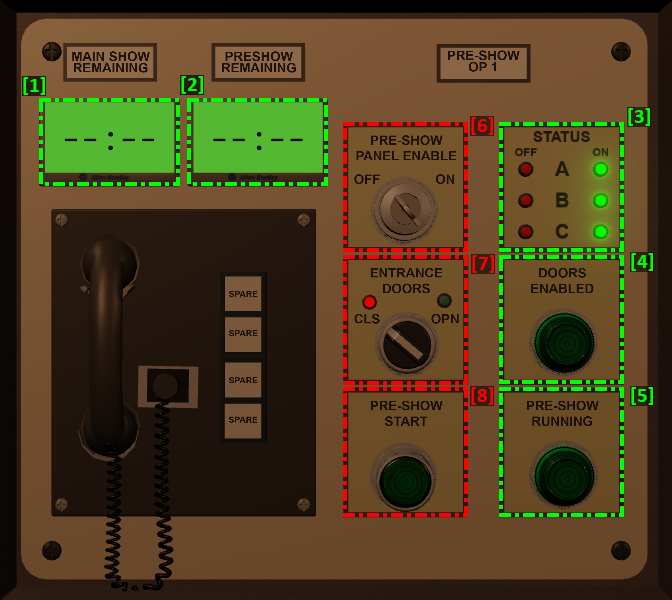
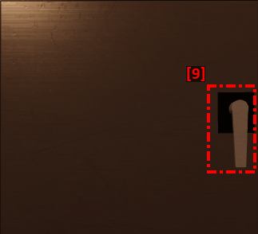
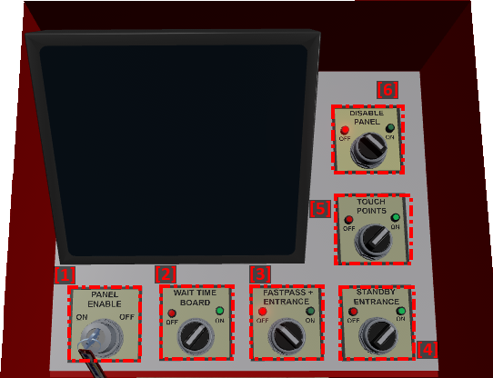
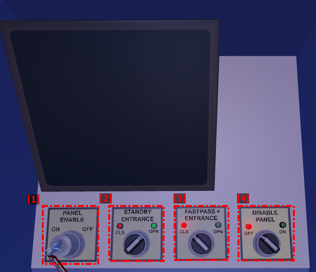

# Panel Information

* [Show](panel-information.md#show)
  * [Main Panel](panel-information.md#main-panel)
    * [Buttons & Indicators](panel-information.md#buttons-and-indicators)
    * [Screens](panel-information.md#screens)
  * [Side Panels](panel-information.md#side-panels)
    * [Buttons & Indicators](panel-information.md#buttons-and-indicators2)
* [Preshow](panel-information.md#preshow)
  * [Preshow Panel](panel-information.md#preshow-panel)
    * [Buttons & Indicators](panel-information.md#buttons-and-indicators3)
  * [Preshow Panel Door](panel-information.md#preshow-panel-door)
    * [Buttons & Indicators](panel-information.md#buttons-and-indicators4)
  * [Section Ropes](panel-information.md#section-ropes)
    * [Buttons & Indicators](panel-information.md#buttons-and-indicators5)
  * [Queue Ropes](panel-information.md#queue-ropes)
    * [Buttons & Indicators](panel-information.md#buttons-and-indicators6)
* [Queue](panel-information.md#queue)
  * [Entrance Panel](panel-information.md#entrance-panel)
    * [Buttons & Indicators](panel-information.md#buttons-and-indicators7)
  * [Mid-Queue Panel](panel-information.md#mid-queue-panel)
    * [Buttons & Indicator](panel-information.md#buttons-and-indicators8)

## Show

### Main Panel

<figure><figcaption>
Located in the far right front of the show room.
</figcaption></figure>

#### **Buttons & Indicators**

* **\[1] Lock Indicator Lights (A):**
  * Left Lock _(Left)_ - Indicates if all 3 rows from the left section are locked.
  * Center Lock _(Center)_ - Indicates if all 3 rows from the center section are locked.
  * Right Lock _(Right)_ - Indicates if all 3 rows from the right section are locked.
* **\[2] Lock Indicator Lights (B):**
  * ~~Lock Fault _(Top Left)_ - Non-Functional.~~
  * ~~Lock Ok _(Top Right)_ - Non-Functional.~~
  * All Unlocked _(Bottom Left)_ - Indicates if all rows are unlocked.
  * All Locked _(Bottom Right)_ - Indicates if all rows are locked.
* **\[3] Light Indicators:**
  * Work Lights On _(Top Left)_ - Indicates if show lights are off.
  * Work Lights Off _(Top Right)_ - Indicates if show lights are on.
  * Show Lights On _(Middle Left)_ - Indicates if show lights are on.
  * Show Lights Off _(Middle Right)_ - Indicates if show lights are off.
  * ~~Exit Lights On _(Bottom Left)_ - Non-Functional.~~
  * ~~Exit Lights Off _(Bottom Right)_ - Non-Functional.~~
* **\[4] Preshow Status Indicator:** Indicates if preshow is playing.&#x20;
* **\[5] Dispatch Status Indicator:** Indicates the status of the dispatch. If its flashing, it means that the ride is ready to dispatch. If it's on it means the ride is dispatched.
* **\[6] Side Panel Indicators:**
  * Left Power Indicator _(Top Left)_ - Indicates if left side panel is on.
  * Center Power Indicator _(Top Center)_ - Indicates if the centerif enter side panel is on.
  * Right Power Indicator _(Top Right)_ - Indicates if right side panel is on.
  * Left Dispatched Indicator _(Bottom Left)_ - Indicates if left side panel has dispatch enabled.
  * Center Dispatched Indicator _(Bottom Center)_ - Indicates if center side panel has dispatch enabled.
  * Right Dispatched Indicator _(Bottom Right)_ - Indicates if right side panel has dispatch enabled.
* **\[7] Exit Doors Indicators:**
  * Doors Closed Indicator _(Left)_ - Indicates if exit doors are closed.
  * Doors Open Indicator _(Right)_ - Indicates if exit doors are open.
* **\[8] Preshow Status Indicator:**
  * Preshow 1 _(Left)_ - Indicates if Section 1 of the preshow is enabled.
  * Preshow 2 _(Center)_ - Indicates if Section 2 of the preshow is enabled.
  * Preshow 3 _(Right)_ - Indicates if Section 3 of the preshow is enabled.
* **\[9] Entrance Doors Indicators:**
  * Closed _(Left)_ - Indicates if entrance doors are closed.
  * Open (Right) - Indicates if entrance doors are open.
* **\[10] Power Key:** This key is used to power on or off the panel. Click it to change its state from on to off or from off to on.&#x20;
* **\[11] Seat Lock:** This switch is used to enable/disable the seat lock. If any of the side panels is on, and you switch it to on, it'll flash until they clear their rows.&#x20;
* **\[12] Work Lights:** This switch is used to enable/disable the show/work lights.
* **\[13] Safety Spiel:** Plays the safety spiel.
* **\[14] Exit Spiel:** Plays the exit spiel.
* **\[15] Stop Spiel:** <mark style="color:red;">(Senior CM+)</mark> Stops the current spiel.&#x20;
* **\[16] Entrance Doors Enable:** Enables the entrance doors so they can be opened from the preshow panel.
* **\[17] Reset Enable:** Resets the door enable permission.
* **\[18] Exit Door Switch:** Open/Closes the exit doors.
* **\[19] Dispatch Enable:** This button is used to enable the dispatch button. It has to be pressed in order to be able to press the dispatch button. You'll be able to click it when you see it's flashing.
* **\[20] Dispatch:** This button is used to dispatch the ride. You'll be able to click it when you see it's flashing.

#### Screens

<figure><figcaption>
Located above the main panel in the show room.
</figcaption></figure>

* **Screen 1 - Vehicle Restraints:** Shows the restraint lock status for each row. Red means it's unlocked. Yellow means it's waiting to be locked manually by a CM. Green means its locked.
* **Screen 2 - Show Countdowns:** Shows a countdown of the main show and preshow. Whenever they're playing it will display how much time is left, when they're not playing it will display --:--.
* **Screen 3 - Show Status:** Shows the status of the main show.

### Side Panels

<figure><figcaption>
Located behind the three columns in the show room.
</figcaption></figure>

<figure><figcaption>
Located to the left of the ride vehicle looking from the back.
</figcaption></figure>

<figure><figcaption>
Located to the left of the entrance door.
</figcaption></figure>

#### Buttons & Indicators

* **\[1] Dispatch Enabled Indicator:** Indicates if side has been dispatch enabled
* **\[2] Power Key:** This key is used to power on or off the panel. Click it to change its state from on to off or from off to on.
* **\[3] Enable:** This button is used to (dispatch) enable the side.
* **\[4] Clear Button/Indicator:** This indicator is also used as a button to clear/lock a row. Whenever the main panel enables the seat lock, you'll have to click it to lock each row. When the indicator is off, it means seat lock is off. When its on, it means its on. When its flashing, it means you need to click it to lock it.
* **\[5] Seat Indicator:** This light indicates the state of each seat. If its off, it means no one is in that spot. If its on, it means it's occupied and locked. If its flashing it means its occupied and not locked.
* **\[6] Row 1 Wall:** This switch enables/disables the row 1 invisible wall.
* **\[7] Row 2 Wall:** This switch enables/disables the row 2 invisible wall.
* **\[8] Row 3 Wall:** This switch enables/disables the row 3 invisible wall.

## Preshow

### Preshow Panel

<figure><figcaption>
Located behind the preshow panel door.
</figcaption></figure>

#### Buttons & Indicators

* **\[1] Main Show Remaining Screen:** Shows a countdown of the main show. Whenever it's playing it will display how much time is left and when it's not, it will display --:--.
* **\[2] Preshow Show Remaining Screen:** Shows a countdown of the pre-show show. Whenever its playing it will display how much time is left and when it's not, it will display --:--.
* **\[3] Section/Side Status Indicator:** Indicates if a section/side is enabled or not.
* **\[4] Doors Enabled Indicator:** Indicates if the main show panel has enabled the doors.
* **\[5] Preshow Running Indicator:** Indicates if the main show is running.
* **\[6] Power Key:** This key is used to power on or off the panel. Click it to change its state from on to off or from off to on.
* **\[7] Entrance Door Switch:** Open/Closes the entrance show doors. Can only be opened when the doors enabled indicator is on.
* **\[8] Preshow Start:** Plays the preshow, which will flash when available.

### Preshow Panel Door

<figure><figcaption>
Located on the wall around the corner at the bottom of the concourse.
</figcaption></figure>

#### Buttons & Indicators

* **\[9] Toggle Panel Door:** Click to open/close the panel door.

### Section Ropes

<figure><figcaption>
Located on the right at the end of each section in the concourse.
</figcaption></figure>

#### Buttons & Indicators

* **\[10] Toggle Section:** <mark style="color:red;">(Senior CM+)</mark> Enables/Disables the section. Do not use if guests are in the section. Preshow panel has to be on to be able to use.

### Queue Ropes

<figure><figcaption>
Located on the left down the long concourse queue ramp.
</figcaption></figure>

#### Buttons & Indicators

* **\[11] Toggle Queue Wall:** Opens/Closes the queue. Use it for crowd control. Requires the preshow panel to be on.

## Queue

### Entrance Panel

<figure><figcaption>
Entrance panel located at the attraction queue entrance.
</figcaption></figure>

#### Buttons & Indicators

* **\[1] Power Key:** This key is used to power on or off the panel. Click it to change its state from on to off or from off to on.
* **\[2] Wait Time Board:** <mark style="color:red;">(Senior CM+)</mark> Enables/Disables the the entrance time boards.
* ~~**\[3] Fastpass+ Entrance:** Non Functional (for now).~~
* **\[4] Standby Entrance:** This switch is used to enable/disable the invisible wall for the standard queue.
* **\[5] Touch Points:** <mark style="color:red;">(Senior CM+)</mark> Enables/Disables the the entrance touch points.
* **\[6] Disable Panel Switch:** <mark style="color:blue;">(Manager+)</mark> This switch is used to toggle disabling the panel.

### Mid-Queue Panel

<figure><figcaption>
Mid-queue panel located at the queue concourse split.
</figcaption></figure>

#### Buttons & Indicators

* **\[1] Power Key:** This key is used to power on or off the panel. Click it to change its state from on to off or from off to on.
* **\[2] Standby Entrance:** This switch is used to enable/disable the invisible wall for the standard queue.
* ~~**\[3] Fastpass+ Entrance:** Non Functional (for now).~~
* **\[4] Disable Panel Switch:** <mark style="color:blue;">(Manager+)</mark> This switch is used to toggle disabling the panel.
